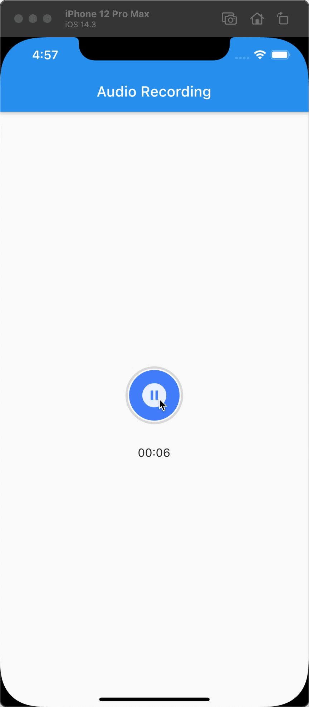

### 📖 项目介绍 📖

这是我的第一个 Speed Code 视频项目，通过此项目可以学习到 `Container、AnimatedSwitcher、FadeTransition、ScaleTransition` 等组件的基础用法，最终我们将构建一个灵动动画的录音状态切换按钮

> 这里按钮全部是用 `Container` 编写的，`圆环` 和 `圆形` 都是 `Container` 的属性效果，具体可以看下面的文章或视频

### 🎥 视频地址 🎥

- [YouTube](https://www.youtube.com/watch?v=1YMaxzePsso)
- [BiliBili](https://www.bilibili.com/video/BV1mV411n7zT/)
- [西瓜视频](https://www.ixigua.com/6947244756007125535?logTag=2bf348f3e5bacbe588df)

### 📒 对应文章 📒

- [语雀](https://www.yuque.com/docs/share/83e1400b-5a0d-4b78-a7a9-55609f42c2d3)

### ☀️ 我的经历 ☀️

- 15 年～18 年，使用 `Android` 原生做智能硬件相关的  App 研发
- 18 年 5 月，一次偶然的机会接触到了 `Flutter` ，然后开始自学，可以看 [weather_flutter](https://github.com/yy1300326388/weather_flutter) 是我练习 Flutter 的入门实战项目（我现在依然觉得他非常适合 Flutter 入门练习使用）
- 18 年 8 月，顶着巨大的压力（Flutter 当时还没有 Release 1.0）开始使用 Flutter 开发企业级项目，并且开发维护了十几个 Flutter 插件包（因为当时插件资源非常的匮乏）
- 截止目前主导并参与上线了 4 款企业级`Flutter` App，当前正在负责开发的一款 App 累计用户 `120W+`，使用 `Flutter` 得到了极佳的体验

